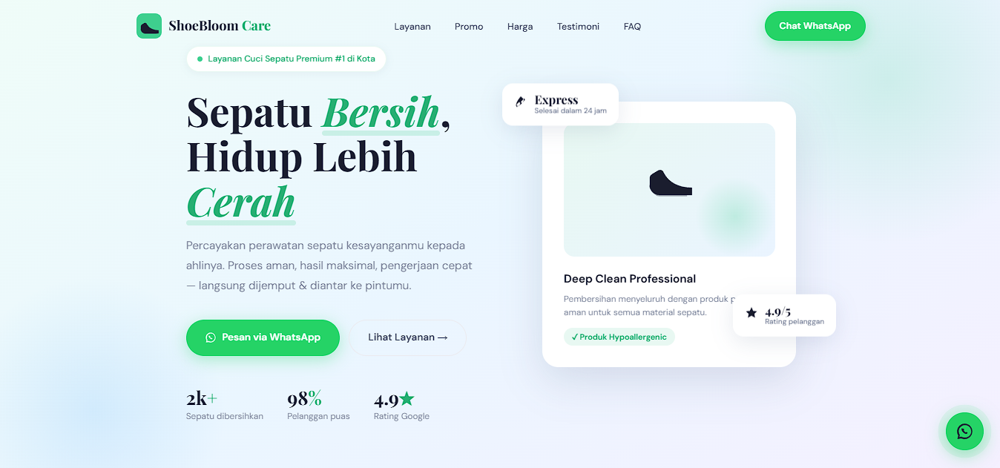
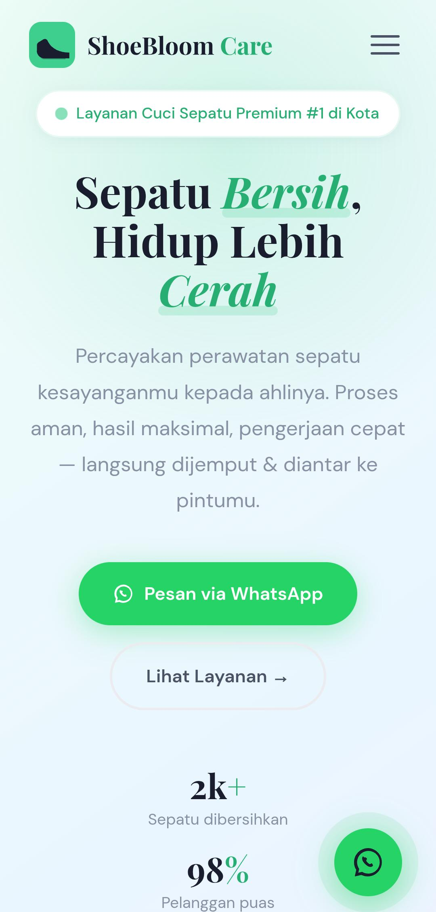

# 👟 ShoeBloom Care — Premium Shoe Cleaning Landing Page

[](https://developer.mozilla.org/en-US/docs/Web/HTML)
[](https://developer.mozilla.org/en-US/docs/Web/CSS)
[](https://developer.mozilla.org/en-US/docs/Web/JavaScript)
[](https://opensource.org/licenses/MIT)

**ShoeBloom Care** adalah sebuah *landing page* modern, responsif, dan berkinerja tinggi yang dirancang untuk jasa layanan perawatan dan cuci sepatu premium. Project ini dibangun menggunakan **Vanilla HTML5, CSS3 dengan pendekatan modern (Flexbox/Grid/Variables), dan Vanilla JavaScript** untuk menyajikan pengalaman pengguna (*user experience*) yang interaktif tanpa bergantung pada *library* pihak ketiga.

🔗 **Live Demo:** https://achraflyy48.github.io/ShoeeBloom-Care/

---

## 📸 Pratinjau Desain

*(Silakan ganti atau tambahkan gambar tangkapan layar web kamu di sini)*
| Versi Desktop | Versi Mobile |
|---|---|
|  |  |

---

## ✨ Fitur Utama

* **Responsive Web Design (RWD):** Dioptimalkan sepenuhnya untuk berbagai perangkat, mulai dari *smartphone* 320px hingga monitor *desktop*.
* **Scroll Reveal Animation:** Animasi masuk komponen yang halus saat pengguna menggulir halaman, memanfaatkan **Intersection Observer API** yang efisien untuk performa optimal.
* **Smart Flash Sale Countdown:** Penghitung waktu mundur promo 48 jam interaktif yang terintegrasi dengan **Web Storage API (`localStorage`)**, memastikan waktu tetap berjalan konsisten meskipun halaman dimuat ulang (*refresh*).
* **Interactive FAQ Accordion:** Fitur tanya-jawab interaktif berbasis state dengan transisi tinggi (`max-height`) yang mulus menggunakan Vanilla JS.
* **Mobile Hamburg Menu Navigation:** Menu navigasi ramah pengguna pada perangkat seluler lengkap dengan fitur penguncian gulir (*scroll lock*) saat menu aktif.
* **Seamless Smooth Scrolling:** Navigasi antar-bagian halaman yang mulus dengan kompensasi tinggi *sticky navbar* agar konten tidak tertutup.
* **Direct WhatsApp Integration:** Tombol CTA (*Call to Action*) yang dinamis dan *floating button* yang langsung terhubung ke API WhatsApp dengan pesan otomatis yang disesuaikan.

---

## 🛠️ Teknologi yang Digunakan

* **Struktur Konten:** HTML5 Semantik (untuk aksesibilitas dan SEO yang lebih baik).
* **Gaya & Tata Letak:** CSS3 dengan kustomisasi properti (*CSS Variables*), CSS Grid, Flexbox, Media Queries, dan animasi kustom (`@keyframes`).
* **Logika & Interaktivitas:** Vanilla JavaScript (ES6+) — *Zero Dependencies*.
* **Tipografi:** Playfair Display (Serif untuk kesan premium) & DM Sans (Sans-serif untuk keterbacaan tinggi) via Google Fonts.

---

## 📂 Struktur Repositori

```text
├── assets/
│   ├── desktopreview.png
│   └── mobilereview.jpeg
├── index.html
├── styles.css
├── script.js
└── README.md
